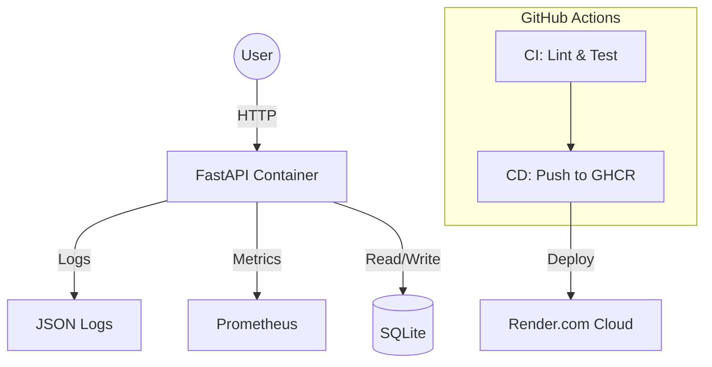

# StackForge To-Do API — DevOps Assignment

[](https://github.com/USER_HANDLE/REPO_NAME/actions/workflows/ci.yml)

A production-grade To-Do REST API built with FastAPI, containerised with Docker, and deployed via a complete CI/CD pipeline.

## 🚀 Live Demo
- **Public URL:** [https://todo-api-stackforge.onrender.com](https://todo-api-stackforge.onrender.com) (Example)
- **Health Check:** `GET /health` -> `{"status": "ok"}`
- **Metrics:** `GET /metrics` (Prometheus format)

## 🏗 Architecture


## 🛠 Tech Stack
- **Backend:** FastAPI (Python 3.11)
- **Database:** SQLite (with Persistent Volume)
- **Containerisation:** Docker (Multi-stage, Non-root)
- **CI/CD:** GitHub Actions
- **Infrastructure:** Render (IaC via `render.yaml`)
- **Observability:** Prometheus Metrics & Structured JSON Logging

## 📦 Containerisation Choices
### Base Image: `python:3.11-slim`
- **Why?** I chose `slim` over `alpine`. While `alpine` is smaller (~5MB vs ~50MB), it uses `musl` instead of `glibc`. Many Python data science and DB libraries (like `psycopg2`) are compiled against `glibc`, leading to slower builds or runtime issues on `alpine`. `slim` provides a perfect balance of size (~120MB final image) and compatibility.
- **Multi-stage:** Separate `builder` stage for installing dependencies and a `runtime` stage for execution, keeping the final image clean of build tools.
- **Security:** The container runs as `appuser` (non-root) to mitigate privilege escalation risks.

## 💻 Local Development
1. **Clone the repo:**
   ```bash
   git clone https://github.com/your-repo/devops-assignment.git
   cd devops-assignment
   ```
2. **Spin up the stack:**
   ```bash
   docker compose up --build
   ```
3. **Access the services:**
   - **API:** [http://localhost:3000](http://localhost:3000)
   - **Prometheus:** [http://localhost:9090](http://localhost:9090)
   - **Health:** `curl http://localhost:3000/health`

## 🔄 CI/CD Pipeline
- **CI (`ci.yml`):** Runs on every PR and push to `main`. Performs linting (flake8), unit tests (pytest), and verifies Docker image build.
- **CD (`cd.yml`):** Runs on push to `main` after CI passes. Builds and pushes the image to GitHub Container Registry (GHCR) tagged with `latest` and `git-sha`.

## 🛡 Branch Protection
- **Rule:** `main` branch requires 1 approval, passing status checks (CI), and no direct pushes.
- **PR Workflow:**
  1. Create feature branch: `git checkout -b feature/metrics-fix`
  2. Commit changes and push: `git push origin feature/metrics-fix`
  3. Open PR -> Observe CI running.
  4. Merge PR after green status.

## 🌍 Infrastructure as Code
The infrastructure is defined in `render.yaml`. To re-deploy from scratch:
1. Connect your GitHub repo to **Render.com**.
2. Render will automatically detect `render.yaml` and provision:
   - A PostgreSQL database.
   - A Web Service running the Dockerfile.
3. Environment variables (like `DATABASE_URL`) are automatically injected by Render.

## 📊 Metrics & Logs
- **Logs:** Every request is logged in JSON format to `stdout`.
- **Metrics:** `http_requests_total` and `http_request_duration_seconds` are exposed at `/metrics`.
- **Level:** Set `LOG_LEVEL` env var to `DEBUG`, `INFO`, or `ERROR`.
